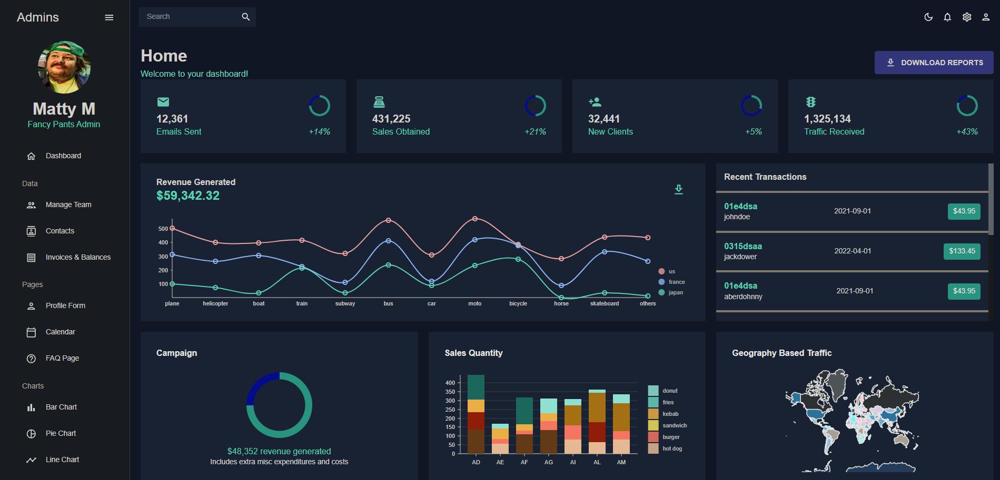
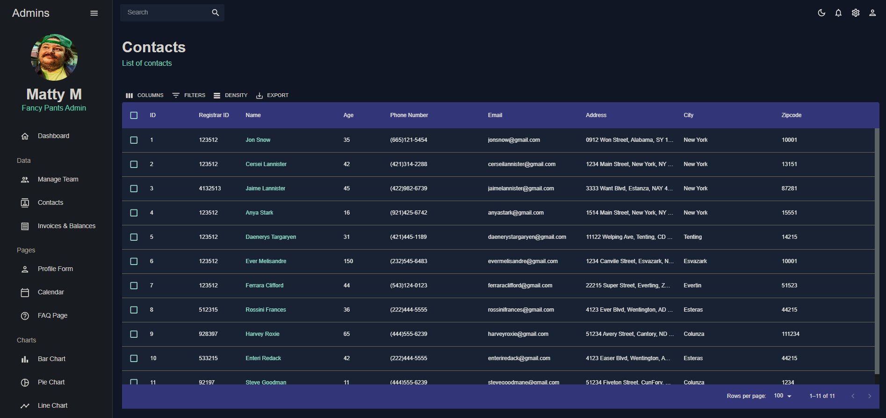

# _Administrator Dashboard_

## By _**Jake Elsberry**_

#### _A dashboard that allows a manger to track business processes. Features static and dynamic components in an effort to explore various React libraries._

#### Home Page



#### Contacts Page



## Technologies Used

* _React_
* _React Router_
* _React Pro Sidebar_
* _MaterialUI_
* _DataGrid_
* _Nivo_
* _Formik_
*  _Node.js_
* _NodePackageManager(NPM)_
* _Javascript_
* _Html_
* _CSS_


## Description

_Monitor businesses performance via dashboard. Track employees, contacts, and invoices. Uses Material UI to present concise and clear data._


## Setup/Installation Requirements

1.  _Clone project from [Github repository](https://github.com/Schmelzberry/react-dashboard)_

2. _Navigate to the root project directory_

3. _Run the command ```$ npm install``` to install all necessary packages and dependencies for project_

4.  _From root directory, run the node server with bash command: ```$ npm run start```_


## Known Bugs
* Calendar functionality for tracking daily business activity is WIP - import statements are not being recognized

## License

_MIT_

Copyright (c) _9/10/2023_ _Jake Elsberry_